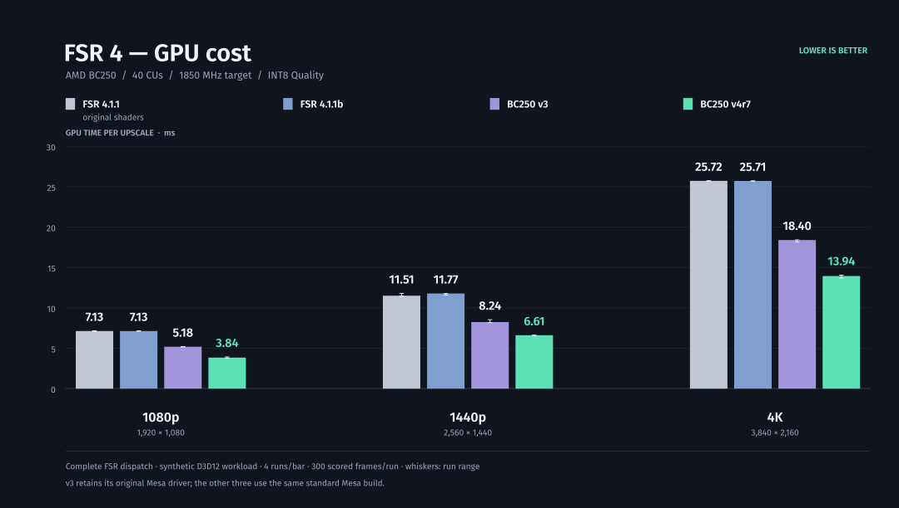

# BC250 FSR4 — portable DLL, RC8

**FSR 4.1.1 INT8 optimizations in one Windows x64 DLL.**
Drop it into a working OptiScaler installation or a compatible native
FidelityFX game. The optimizations are built into the DLL.

This is the **4.0.0-rc8 performance checkpoint**; the DLL identifies itself as
**4.1.1r8**. Its exact bytes are tested on BC250/Linux. Windows and other
GPUs remain unqualified.



The chart shows the earlier RC7 campaign. [Method and raw data](docs/gpu-cost.md).

**RC8 reduces measured 1440p Quality upscaler GPU time by 8.52% versus RC7:**
6.617 ms → 6.054 ms in fresh matched tests. All output images match exactly.
This checkpoint was measured at 1440p only; the chart's other resolutions
remain RC7 results. [RC8 measurements and raw data](docs/portable-dll-rc8.md).

## Install

Download the [RC8 release](https://github.com/daniel-h-0/bc250-fsr4-fork/releases/tag/v4.0.0-rc8):
[ZIP](https://github.com/daniel-h-0/bc250-fsr4-fork/releases/download/v4.0.0-rc8/bc250-fsr4-dll-4.0.0-rc8.zip) or
[tar.xz](https://github.com/daniel-h-0/bc250-fsr4-fork/releases/download/v4.0.0-rc8/bc250-fsr4-dll-4.0.0-rc8.tar.xz).

Extract `bc250-fsr4-dll-4.0.0-rc8.zip` (or the smaller `.tar.xz` archive).
It contains one DLL, instructions, checksums and notices. Close the game and
back up any file you replace.

**Already using OptiScaler:** replace
`OptiScaler/amd_fidelityfx_upscaler_dx12.dll` with the RC8 DLL. Select the
FFX/FSR4 backend and INT8 model 2. The [short installation guide](dll/INSTALL.md)
has the exact settings and the ordinary Proton launch option.

**Native FidelityFX game:** replace its compatible upscaler DLL. Native
loader versions differ: Deadzone Rogue uses the upscaler filename, while
the tested KCD2 integration requires the same bytes under the loader filename.
Follow the [filename and loader notes](docs/portable-dll-rc7.md#native-game-loaders).

To undo, close the game and restore the backed-up DLL. Game updates may
replace it. Use one upscaler integration per game.

## Compatibility

RC8 passed direct D3D12 API, image and performance checks at 1440p on
BC250/Linux with standard Mesa and ordinary GE-Proton. It has no new game
rendering checks. The earlier RC7 DLL passed Control, System Shock, No Man's
Sky, Deadzone Rogue, Kingdom Come: Deliverance II, Roboquest with Luma, and
DOOM: The Dark Ages through native FSR and OptiScaler's DX11/DX12/Vulkan routes.

No Man's Sky hit its hang detector during initial shader compilation;
restarting with the compiled cache worked. Frame generation, native Windows,
other GPUs and unlisted integrations need separate testing.
[RC8 scope](docs/portable-dll-rc8.md) and [RC7 game evidence](docs/portable-dll-rc7.md).

## What changed

RC8 changes sixteen of the 348 shader slots. It combines native packed
integer dot products, Winograd convolution in two model passes, streamed
arithmetic, cooperative weight checks and measured wave-size choices.
Dynamic-weight guards and fallbacks remain present. The other 332 shader
slots keep their RC7 bytes.

The RC7 integer-cast compatibility repair and SDK synchronization barrier
before padding clears are retained. The SDK's numeric API/provider identity
and five public exports stay the same.

The RC8 comparison includes eight 600-frame runs, scoring the last 300
frames of each, plus seven separate image cases covering HDR, SDR, motion,
reset, dynamic resolution, sharpening and Balanced input. These are synthetic
upscaler timings, with no whole-game FPS claim.

## Build and review

The complete, editable LLVM/DXIL sources and pinned SDK/DXC identities are
under [dll/](dll/README.md). Rebuilding validates every shader and must produce
the exact release DLL hash. Build tools are needed only by developers.

```sh
python3 scripts/check-repo.py
python3 dll/build.py --sdk /path/to/original/amd_fidelityfx_upscaler_dx12.dll \
  --dxcompiler /path/to/dxc/lib/libdxcompiler.so --output .work/dll --jobs 2
python3 scripts/package-dll.py --dll .work/dll/amd_fidelityfx_upscaler_dx12.dll
```

See [distribution and source archives](docs/releases.md), the
[changelog](CHANGELOG.md), and [provenance and licenses](THIRD_PARTY.md).
For the older driver and Steam tool, see the
[RC6 guide and upgrade notes](docs/legacy-rc6.md).

## Special thanks

This work continues [dmoraza's BC250 FSR4 project](https://github.com/dmorazasanchez/bc250-fsr4).
Thanks to AMD/GPUOpen, the Mesa and RADV contributors, Microsoft DXC,
Wine, vkd3d-proton, Valve Proton, GE-Proton and OptiScaler for the underlying
algorithms, compilers and compatibility work. Their licenses and attribution
remain with the source and release notices.
