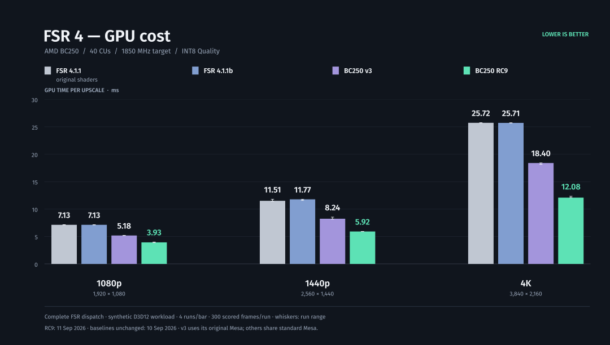

# BC250 FSR4 — portable DLL, RC9

**FSR 4.1.1 INT8 optimizations in one Windows x64 DLL.**
Drop it into a working OptiScaler installation or a compatible native
FidelityFX game. The optimizations are built into the DLL.

This is the **4.0.0-rc9 performance checkpoint**; the DLL identifies itself as
**4.1.1r9**. Its exact bytes are tested on BC250/Linux. Windows and other
GPUs remain unqualified.



**RC9 costs 3.93 / 5.92 / 12.08 ms at 1080p / 1440p / 4K Quality.**
Only RC9 was remeasured on September 11; the three baseline arms retain their
September 10 timestamps. All complete output images match.
[Chart method and raw data](docs/gpu-cost.md) · [RC9 changes and qualification](docs/portable-dll-rc9.md).

## Install

**New to OptiScaler?** Start with the [illustrated beginner walkthrough](docs/beginner-guide.md):
one pinned adapter version, exact game folders, Steam/Heroic choices, a real
RC9 watermark reference and undo instructions. Cyberpunk and Control have
worked recipes; native DLL replacements have separate steps.

**First use can look frozen.** The first time this FSR path is enabled without
a usable shader cache, the graphics driver and Proton may spend tens of seconds
or longer compiling its shaders. The game can stop updating or appear
unresponsive during that work, even though the DLL is already installed.
Allow time for compilation before force-closing it. Later launches can reuse
the cache; changing the GPU, driver, Proton or shader version can trigger more
compilation. [First-launch guidance and troubleshooting](docs/first-run-shader-compilation.md).

Download the [RC9 release](https://github.com/daniel-h-0/bc250-fsr4-fork/releases/tag/v4.0.0-rc9):
[ZIP](https://github.com/daniel-h-0/bc250-fsr4-fork/releases/download/v4.0.0-rc9/bc250-fsr4-dll-4.0.0-rc9-docs2.zip) or
[tar.xz](https://github.com/daniel-h-0/bc250-fsr4-fork/releases/download/v4.0.0-rc9/bc250-fsr4-dll-4.0.0-rc9-docs2.tar.xz).

Extract `bc250-fsr4-dll-4.0.0-rc9-docs2.zip` (or the smaller `.tar.xz` archive).
It contains one DLL, instructions, checksums and notices. Close the game and
back up any file you replace. The `docs2` refresh also corrects watermark removal;
the RC9 DLL is unchanged. [Documentation corrections](docs/releases.md#documentation-refresh-2).

**Already using OptiScaler:** replace
`OptiScaler/amd_fidelityfx_upscaler_dx12.dll` with the RC9 DLL. Select the
FFX/FSR4 backend and INT8 model 2. The [short installation guide](dll/INSTALL.md)
has the exact settings and the ordinary Proton launch option.

**Native FidelityFX game:** replace its compatible upscaler DLL. Native
loader versions differ: Deadzone Rogue uses the upscaler filename, while
the tested KCD2 integration requires the same bytes under the loader filename.
Follow the [filename and loader notes](docs/portable-dll-rc7.md#native-game-loaders).

To undo, restore the backed-up DLL and the launch settings changed for this
installation. If you added a fresh adapter, remove only its added files.
The [undo checklist](docs/beginner-guide.md#undo) distinguishes these cases.
Game updates may replace the DLL. Use one upscaler integration per game.

## Compatibility

RC9 passed direct D3D12 API, image and performance checks at 1080p, 1440p and 4K on
BC250/Linux with standard Mesa and ordinary GE-Proton. It has no new game
rendering checks. The earlier RC7 DLL passed Control, System Shock, No Man's
Sky, Deadzone Rogue, Kingdom Come: Deliverance II, Roboquest with Luma, and
DOOM: The Dark Ages through native FSR and OptiScaler's DX11/DX12/Vulkan routes.

No Man's Sky hit its hang detector during initial shader compilation;
restarting with the compiled cache worked. See the
[first-launch note](docs/first-run-shader-compilation.md) before treating an
initial pause as a failed installation. Frame generation, native Windows,
other GPUs and unlisted integrations need separate testing.
[RC9 scope](docs/portable-dll-rc9.md) and [RC7 game evidence](docs/portable-dll-rc7.md).

## What changed

RC9 changes twelve shader slots from RC8, or nineteen from RC7. It adds
bounded packed arithmetic in model passes 1, 2, 4, 5, 7, 9, 10, 11 and 12,
including additional Winograd convolution and reordered integer accumulation,
plus exact final-output lane extraction. Dynamic-weight guards and fallbacks,
the integer-cast compatibility repair and the SDK synchronization barrier remain.
All 348 shaders are identical to the retained qualified development checkpoint.

The new chart contains twelve RC9 runs of 600 frames, scoring the final 300
frames of each. Three resolution preflights and seven additional 1440p image
cases match the verified references. These are synthetic upscaler costs.
Compared with the historical RC7 chart, RC9's 1440p and 4K values are lower;
its 1080p value is slightly higher. Those chart comparisons span two dates.

## Build and review

The complete, editable LLVM/DXIL sources and pinned SDK/DXC identities are
under [dll/](dll/README.md). Rebuilding validates every shader and must produce
the exact release DLL hash. Build tools are needed only by developers.

```sh
python3 scripts/check-repo.py
python3 dll/build.py --sdk /path/to/original/amd_fidelityfx_upscaler_dx12.dll \
  --dxcompiler /path/to/dxc/lib/libdxcompiler.so --output .work/dll --jobs 2
python3 scripts/package-dll.py --dll .work/dll/amd_fidelityfx_upscaler_dx12.dll --documentation-revision 2
```

See [distribution and source archives](docs/releases.md), the
[changelog](CHANGELOG.md), and [provenance and licenses](THIRD_PARTY.md).
For the older driver and Steam tool, see the
[RC6 guide and upgrade notes](docs/legacy-rc6.md).

## Special thanks and notes

This work continues [dmoraza's BC250 FSR4 project](https://github.com/dmorazasanchez/bc250-fsr4).
Thanks to AMD/GPUOpen, the Mesa and RADV contributors, Microsoft DXC,
Wine, vkd3d-proton, Valve Proton, GE-Proton and OptiScaler for the underlying
algorithms, compilers and compatibility work. Their licenses and attribution
remain with the source and release notices. This work was accomplished with the
assistance of GPT-6-Astra, with constant human review and oversight.
