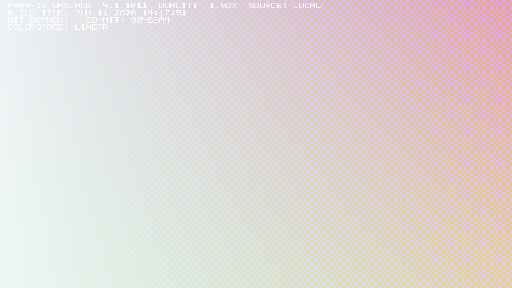

# Manual installation

For installation and updates from one game list, use
[Install across your games](optiscaler-client.md). This page covers manual
replacement, general adapter setup, native games and verification.

**Replace OptiScaler's upscaler DLL, select FFX/INT8, and play.** Use your normal
graphics driver, Proton and working launch settings.

For supported games with native FidelityFX integration, use the
[direct DLL recipes](#native-fidelityfx-games) instead of setting up OptiScaler.

These instructions use [OptiScaler 10.0.0-pre1, September 4, 2026](https://github.com/optiscaler/OptiScaler-nightly/releases/tag/nightly-20260904).
The [OptiScaler team and contributors](https://github.com/optiscaler/OptiScaler)
provide the adapter and [OptiPatcher](https://github.com/optiscaler/OptiPatcher)
plugin; BC250 FSR4 supplies the optimized upscaler DLL.
Already working? Keep its game-specific settings and launch options.
New to OptiScaler? Expand the setup below first.

<details>
<summary>First time? Install OptiScaler in your game</summary>

1. Close the game and open its installation folder from your launcher. In Steam,
   use **Properties → Installed Files → Browse**. In other launchers, use the
   game's install location or browse-files action.
   Find the actual 64-bit game executable; Unreal games usually keep it under
   `Binaries/Win64`. See [upstream installation](https://github.com/optiscaler/OptiScaler/wiki/Manual-Installation).
   Back up existing files and launch options before changing them.
2. [Download OptiScaler](https://github.com/optiscaler/OptiScaler-nightly/releases/download/nightly-20260904/OptiScaler_v10.0.0-pre1_20260904.7z)
   and extract **all its contents** beside that executable, keeping subfolders.
   Rename `OptiScaler.dll` to **`dxgi.dll`** (upstream's general default).
   Keep `OptiScaler.ini` named as-is. If another mod already uses that DLL name,
   follow its supported chaining instructions before replacing anything.
3. Save [OptiPatcher 0.41](https://github.com/optiscaler/OptiPatcher/releases/download/v0.41/OptiPatcher_v0.41.asi)
   as `OptiScaler/plugins/OptiPatcher.asi`. In `OptiScaler.ini`, under `[Plugins]`,
   set **`LoadAsiPlugins=true`**.
4. If the executable folder has no `nvngx_dlss.dll`, add the
   [signed DLSS helper](https://raw.githubusercontent.com/NVIDIA/DLSS/a291cc7d2cc642a51566f3dfd5376f635cd1b284/lib/Windows_x86_64/rel/nvngx_dlss.dll)
   there. Keep an existing game-provided copy.
5. Continue below. On Linux, also
   use the [OptiScaler loading step](#fresh-linux-install-load-optiscaler).

These are OptiScaler setup steps. You only repeat the DLL replacement below
when updating this project's upscaler.

</details>

## 1. Replace one file

Download and extract the [RC11 DLL ZIP](https://github.com/daniel-h-0/bc250-fsr4-fork/releases/download/opticlient-v1.0.7-bc250.2/bc250-fsr4-dll-4.0.0-rc11-docs2.zip).
Close the game. Back up the existing file, then copy the downloaded
**`amd_fidelityfx_upscaler_dx12.dll`** over:

```text
Your game's executable folder/
├── Game.exe
├── dxgi.dll                           OptiScaler
├── OptiScaler.ini
└── OptiScaler/
    └── amd_fidelityfx_upscaler_dx12.dll   ← replace this with RC11
```

Keep the filename and the rest of OptiScaler in place. Its default settings
load this local file. Leave the download's optional `linux/` helpers unused.

**Previously followed the shared-DLL guide?** Set `[Libraries] OptiDllPath=auto`
and `FfxDx12SRPath=auto` in the game's INI to use this local copy.

## 2. Select FSR4 INT8

Open `OptiScaler.ini` beside the executable. Edit these keys in their existing
sections and keep the other settings.

```ini
[Upscalers]
Dx12Upscaler=ffx
Dx11Upscaler=ffx_12
VulkanUpscaler=ffx_12

[FSR]
UpscalerIndex=0
Fsr4ForceModel=2
FsrNonLinearColorSpace=false
```

These select the FFX backend and INT8 model for the supported renderers.
Leave frame generation off in the game and set `[FrameGen] Enabled=false` in
OptiScaler for this setup. Keep the game's working input/spoofing settings.

## 3. Play and check once

Launch normally and select **DLSS**, or an FSR/XeSS input supported by the
game's OptiScaler integration. That is the input OptiScaler uses to feed
FSR4. **Keep the launch settings that already load OptiScaler.**

For the first check, set `[FSR] Fsr4EnableWatermark=true`, restart and enter a
rendered scene. Look for **`4.1.1R11`**, **`FSR-INT8`** and **`SOURCE: LOCAL`**.
Then set `Fsr4EnableWatermark=auto` and restart to hide it. Remove any explicit
`MLSR-WATERMARK` launch variable.

First use can pause while shaders compile. Keep normal caches enabled;
[compilation help](first-run-shader-compilation.md) covers stalls and retries.

<details>
<summary>Watermark reference and download checksum</summary>



This synthetic reference uses the same linear-input settings as the guide.
The banner should read `COLORSPACE: LINEAR`.
[Capture record](data/beginner-watermark-rc11.json).

Run `sha256sum -c SHA256SUMS` in the extracted download to verify its files.
The RC11 DLL is 94,840,832 bytes, SHA256:

```text
8192ea97620f8e6407bff346bf905f0d555ff73d89fe14616eb1fa5e41ab3175
```

</details>

## Fresh Linux install: load OptiScaler

**Skip this if OptiScaler already loads.** This is the normal Wine/Proton loading
step for a new adapter installation, separate from replacing its FSR DLL.
Use ordinary Proton; the recorded game checks used GE-Proton 11-6.

Use the shared [launcher setup table](optiscaler-client.md#launcher-setup) for
Steam, Heroic, Lutris, Bottles and other Wine frontends. It applies equally to
manual installations: match the override to your adapter filename and preserve
existing settings. It also covers launcher-generated Steam shortcuts and
Flatpak folder access.

Press **Insert** in-game to check that OptiScaler opens.
[Upstream compatibility notes](https://github.com/optiscaler/OptiScaler/wiki/Compatibility-List)
cover additional input/loading requirements. Native Windows does not use these
Wine launch settings; see [tested scope](#tested-scope).

## Native FidelityFX games

These two games can use RC11 directly, without OptiScaler. Back up the file
before replacing it with RC11:

| Game | File to replace | In-game choice |
| --- | --- | --- |
| Deadzone Rogue | `Valhalla/Binaries/Win64/amd_fidelityfx_upscaler_dx12.dll` | Native FSR4 |
| Kingdom Come: Deliverance II | `Bin/Win64Shared/amd_fidelityfx_loader_dx12.dll` | FSR 4.1 |

For KCD2, rename a copy of RC11 to the loader filename and keep the game's
original upscaler DLL. This loader replacement is specific to KCD2 1.5.6.
Keep working launch settings. To check the native watermark on Steam/Linux, use `env 'MLSR-WATERMARK=1' %command%`, preserving
any existing arguments. Restore the previous launch options afterward.

## Check that RC11 is rendering

The [step 3 watermark](#3-play-and-check-once) identifies the active DLL.

## If the check fails

| Symptom | Check |
| --- | --- |
| OptiScaler does not open with Insert | Actual executable folder, adapter filename and the Linux loading step above. |
| DLSS is missing | [Upstream compatibility notes](https://github.com/optiscaler/OptiScaler/wiki/Compatibility-List), signed helper beside the executable, and `LoadAsiPlugins=true` for OptiPatcher. |
| Wrong version or `SOURCE: DRIVER` | Replaced file, default library paths and competing automatic upscaler options; see below. |
| Wrong color-space label | Restore `[FSR] FsrNonLinearColorSpace=false`, `FsrNonLinearSRGB=auto`, `FsrNonLinearPQ=auto`. |
| First use stalls | [Compilation troubleshooting](first-run-shader-compilation.md); retain normal caches. |
| Watermark will not disappear | Use `auto` and remove `MLSR-WATERMARK`, including a value of `0`. |

<details>
<summary>Existing overrides, automatic upscalers, or a previously working compatibility line</summary>

Keep working launch options when replacing the DLL. Use the settings below
when your game needs the compatibility configuration from the recorded checks.

- A custom `[Libraries] FfxDx12SRPath` or `OptiDllPath` can select a different
  file. Set both to `auto` to use the local DLL. To inspect its path, temporarily
  set `[Log] LogToFile=true`, `LogLevel=2`; look for the upscaler's `Loaded from`
  entry in `OptiScaler.log`, then restore the logging settings.
- If you enabled Proton's automatic OptiScaler/FSR upgrade options, disable
  them for this manual install (`PROTON_USE_OPTISCALER=0`, `PROTON_FSR4_UPGRADE=0`).
  The recorded manual setup also disabled the competing AMD provider using
  `amdxcffx64=` inside `WINEDLLOVERRIDES`.
- The recorded GE-Proton setup used `PROTON_USE_XALIA=0` to keep the adapter out
  of its accessibility helper. Vulkan interop needed the extension exclusion
  included in the recorded compatibility line below.

The complete earlier compatibility line is below. Use the matching proxy name
and keep any game arguments/other mod overrides you already need:

```sh
/usr/bin/env PROTON_FSR4_UPGRADE=0 PROTON_USE_OPTISCALER=0 PROTON_USE_XALIA=0 WINEDLLOVERRIDES="winmm=n,b;amdxcffx64=" VKD3D_DISABLE_EXTENSIONS="VK_NVX_binary_import,VK_NVX_image_view_handle" %command%
```

For Heroic, these are separate environment-variable name/value pairs.
If moving from the old BC250 driver/Steam tool, use its
[migration instructions](legacy/runtime/legacy-rc6.md#upgrade-a-game-to-rc7) first.

</details>

## Update an existing installation

**Installed through the BC250 client?** Use its
[update or restore actions](optiscaler-client.md#update-or-restore) so its file
records stay consistent. The steps below are for manual installations.

Close the game, back up the current DLL, and replace that same file. Keep the
adapter, INI and working launch settings. Repeat for each game's OptiScaler
installation. Game/adapter updates may restore their bundled DLL; check the
version afterward.

## Undo

Close the game and restore the DLL backup. Restore any INI/launch settings you
changed. If removing a fresh adapter installation, remove only files you added
and restore replaced originals. Preserve other mods, saves and Proton prefixes.
For native replacement, restore the original file you replaced.

<details>
<summary>Optional: keep one shared DLL for multiple games</summary>

Store the DLL in a permanent folder, for example `~/Games/BC250-FSR4`, and point
each game's `OptiScaler.ini` at it:

```ini
[Libraries]
OptiDllPath=auto
FfxDx12SRPath=Z:\home\YOUR_USER\Games\BC250-FSR4\amd_fidelityfx_upscaler_dx12.dll
```

Replace `YOUR_USER`, use the full path without quotes, and ensure the folder is
visible inside the launcher/sandbox. Each game still needs its own adapter and
settings. Verify the watermark: OptiScaler can fall back if the shared path fails.
Close all games using it before updating that one shared file; every configured
game gets the update. To return a game to its local copy, set `FfxDx12SRPath=auto`.
Keep the shared folder while other games still use it. Compiled caches remain
managed separately; [shared caching](shared-shader-cache.md) is optional.

</details>

## Tested scope

BC250/Linux is the tested platform. RC11 has synthetic rendering checks;
[earlier game-route checks](legacy/research/portable-dll-rc7.md#supported-scope) used RC7 and the
recorded Cyberpunk install used RC9. See [RC11 validation](portable-dll-rc11.md).
Frame generation, native Windows, other GPUs and unlisted combinations need
separate testing. Windows needs a runtime/driver accepting DXIL 1.9 / Shader Model 6.9.

[Documentation index](README.md) · [Upstream installation](https://github.com/optiscaler/OptiScaler/wiki/Automated-Installation)
