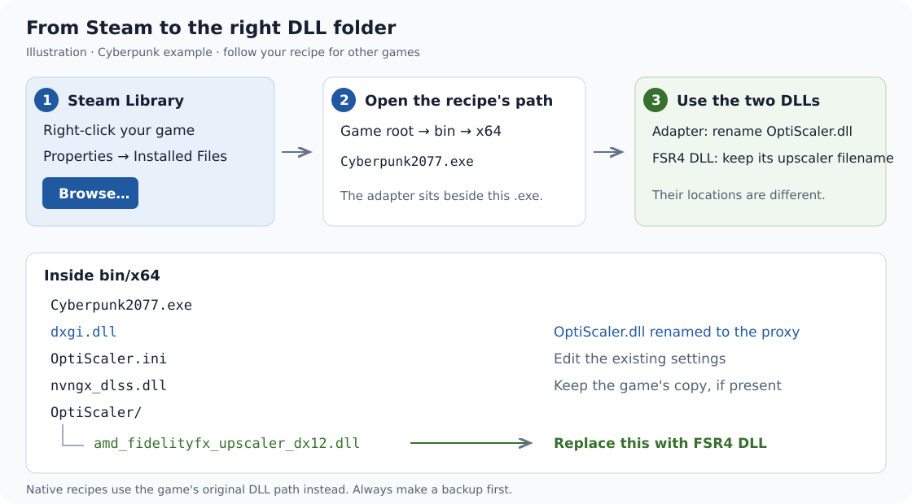
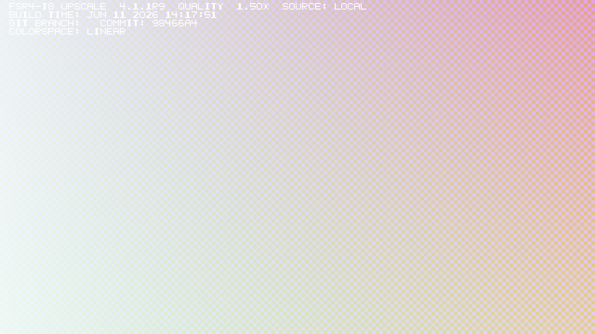

# Install RC9 in a game: beginner walkthrough

RC9 supplies the upscaler. **OptiScaler is the adapter** that lets a supported
game feed it through an existing DLSS, FSR or XeSS option. You install the two
downloads together; selecting DLSS in the game does not mean the final image
is being upscaled by NVIDIA's DLSS.

Start with [Cyberpunk 2077](#cyberpunk-2077-steam-or-heroic) or
[Control](#control-ultimate-edition). [Choose another game](#game-recipes) if
needed. The steps use ordinary file-manager copy/rename actions.

**Scope:** BC250/Linux with ordinary Proton is the tested platform. The seven
[recorded game checks](portable-dll-rc7.md#supported-scope) used RC7; the RC9
installation and synthetic checks do not retest every game. Cyberpunk's RC9
configuration is installed but has no fresh RC9 gameplay check. Native Windows
and other GPUs remain unqualified. The Windows file/setup choices below explain
placement, not a promise that the DLL will render on that platform.

## 1. Download these exact files

| Download | What it provides |
| --- | --- |
| [RC9 ZIP, documentation refresh 1](https://github.com/daniel-h-0/bc250-fsr4-fork/releases/download/v4.0.0-rc9/bc250-fsr4-dll-4.0.0-rc9-docs1.zip) · [smaller tar.xz](https://github.com/daniel-h-0/bc250-fsr4-fork/releases/download/v4.0.0-rc9/bc250-fsr4-dll-4.0.0-rc9-docs1.tar.xz) | The RC9 `amd_fidelityfx_upscaler_dx12.dll`, corrected instructions, checksums and notices. |
| [OptiScaler 10.0.0-pre1, September 4, 2026](https://github.com/optiscaler/OptiScaler-nightly/releases/download/nightly-20260904/OptiScaler_v10.0.0-pre1_20260904.7z) | The separately maintained adapter. This guide uses this exact nightly's `OptiScaler/` subfolder layout. |
| [OptiPatcher 0.41](https://github.com/optiscaler/OptiPatcher/releases/download/v0.41/OptiPatcher_v0.41.asi) | The input-unlocking plug-in used with the recorded adapter setup. Save it as `OptiScaler/plugins/OptiPatcher.asi`. |
| [Signed NVIDIA `nvngx_dlss.dll` 310.7.0](https://raw.githubusercontent.com/NVIDIA/DLSS/a291cc7d2cc642a51566f3dfd5376f635cd1b284/lib/Windows_x86_64/rel/nvngx_dlss.dll) | A helper to place beside the game executable **if that folder does not already contain one**. Keep an existing game-provided copy. |

The two native-DLL recipes need only the RC9 download. OptiScaler, OptiPatcher
and NVIDIA's helper are downloaded from their respective upstream projects;
they are not included in this project's DLL archive. Keep their notices.

Extract the two archives into separate temporary folders. Open the `.7z` with
an archive manager that supports 7-Zip files. Download the named release assets,
not GitHub's **Source code** archive. Stable OptiScaler builds and other nightlies
can have different files and instructions; do not mix their layouts here.

<details>
<summary>Verify downloads and distinguish DLL checksums from archive checksums</summary>

The RC9 DLL is **111,815,680 bytes** and has SHA256:

```text
eefcac03ab17b04a29a5bb16e3f3e9c3181ba9ea46b05a61cb49a5003e1516ef
```

In the extracted RC9 folder, Linux can run `sha256sum -c SHA256SUMS`. On Windows:

```powershell
Get-FileHash .\amd_fidelityfx_upscaler_dx12.dll -Algorithm SHA256
```

Each compressed archive has its own adjacent `.sha256` download on the
[release page](https://github.com/daniel-h-0/bc250-fsr4-fork/releases/tag/v4.0.0-rc9).
Its hash differs from the DLL hash above because it checks the entire archive.
The `-docs1` suffix changes the instructions/packaging, not the DLL.

Pinned upstream SHA256 values:

| File | SHA256 |
| --- | --- |
| `OptiScaler_v10.0.0-pre1_20260904.7z` | `730d5057338cf68adc3bf38a358985a04629ad00fae305bd717694a392216a53` |
| `OptiPatcher_v0.41.asi` | `fb12735bfcc0d47f534f2206d57ec34129dc3d22b6405a1c2ef86745ab48b2eb` |
| Downloaded `nvngx_dlss.dll` | `be6e434a94ca32499515eb62ca0e6c274526055d568d0426e4c652dcdfb6ee6e` |

The original RC9 archives had an RC8 size/hash in their README footer, although
their DLL and `SHA256SUMS` were correct. Use the `-docs1` archives and this guide
for corrected instructions. Original assets and their checksums remain available
as historical records.

</details>

## 2. Open the correct game folder and make a backup

Close the game. In desktop Steam, right-click it in **Library → Properties →
Installed Files → Browse**. Treat the folder that opens as **the game root**.
For Heroic, use the game's installation folder shown in its settings.



Follow your [game recipe](#game-recipes) from that root. For Unreal games, the
executable that renders the game is usually several folders below the small
launcher at the root. Match the exact `.exe` listed in the recipe.

Create a dated backup folder outside the game directory. Save the original DLL
you will replace and a copy of the current Steam launch options. If OptiScaler
is already installed, back up its INI and use [the update path](#update-an-existing-installation).
If another mod occupies the proposed `dxgi.dll` or `winmm.dll`, preserve it and
follow that mod's supported chaining instructions before continuing. This fresh
setup assumes the chosen proxy filename is free.

## 3. Install the adapter and RC9

Skip this section for the two **native** recipes.

1. Copy **the contents** of the extracted OptiScaler archive into the recipe's
   executable folder. Keep its `OptiScaler` and `Licenses` subfolders intact.
2. Rename the copied **`OptiScaler.dll`** to the recipe's proxy name:
   `dxgi.dll` for Cyberpunk, or `winmm.dll` for the other adapter recipes here.
   Keep the name **`OptiScaler.ini`** unchanged.
3. Place the pinned plug-in at `OptiScaler/plugins/OptiPatcher.asi`, creating
   `plugins` if needed. The pinned nightly does not include this plug-in.
4. If the executable folder has no `nvngx_dlss.dll`, copy the signed helper
   there. Its placement beside the proxy mattered in the recorded System Shock
   check; a copy only in an external folder did not expose DLSS.
5. Back up `OptiScaler/amd_fidelityfx_upscaler_dx12.dll`. Replace **that file**
   with the RC9 DLL. RC9 keeps its original filename inside this subfolder.

For Cyberpunk, the result is:

```text
Cyberpunk 2077/
└── bin/x64/
    ├── Cyberpunk2077.exe                  existing game executable
    ├── dxgi.dll                          renamed OptiScaler.dll
    ├── OptiScaler.ini                    adapter settings
    ├── nvngx_dlss.dll                    existing game copy, or signed helper
    ├── Licenses/                        upstream notices
    └── OptiScaler/
        ├── amd_fidelityfx_upscaler_dx12.dll   RC9 goes HERE
        ├── plugins/OptiPatcher.asi
        └── ...                          keep the other extracted files
```

`dxgi.dll`/`winmm.dll` is the adapter, and the nested upscaler DLL is RC9.
Renaming the RC9 DLL to `dxgi.dll` would not install the adapter.

<details>
<summary>If using the upstream setup script instead of manually renaming</summary>

Use **one** method. After copying the archive into the executable folder,
Windows can run `setup_windows.bat`; Linux can open a terminal in that folder
and run `bash setup_linux.sh`. Choose **1 / dxgi.dll** for Cyberpunk, or
**2 / winmm.dll** for the other adapter recipes. On BC250, choose AMD/Intel
(Windows) or answer **n** to “Nvidia GPU” (Linux). For another GPU, answer
according to the actual hardware.

For “DLSS inputs”, choose **No** for Cyberpunk and DOOM's FSR input, or **Yes**
for the DLSS recipes. Apply the explicit recipe settings below afterwards.
If Windows offers to redownload OptiPatcher, keep the pinned 0.41 copy. Do not
accept an overwrite of an unrelated existing proxy. Still complete the helper,
RC9 replacement and INI steps; a setup-script success message does not verify RC9.

</details>

## 4. Set the backend and launch options

With the game closed, open `OptiScaler.ini` in a text editor. **Edit these keys
in their existing sections**; do not paste a second copy of a section at the end.
Then apply the small game-specific additions in your recipe.

```ini
[Upscalers]
Dx12Upscaler=ffx
Dx11Upscaler=ffx_12
VulkanUpscaler=ffx_12

[FSR]
UpscalerIndex=0
Fsr4ForceModel=2
FsrNonLinearColorSpace=false
FsrNonLinearSRGB=auto
FsrNonLinearPQ=auto
Fsr4EnableWatermark=true

[Libraries]
OptiDllPath=auto
FfxDx12SRPath=auto
NvngxDlssPath=auto

[FrameGen]
Enabled=false
FGInput=nofg
FGOutput=nofg
```

These select FSR4 INT8 and turn on a temporary watermark for the first check.
Leave frame generation off in the game too. Keep the game's working resolution
and quality setting; this guide does not choose graphics performance for you.

**Steam on Linux:** in **Properties → Compatibility**, use ordinary Proton
(the recorded checks used GE-Proton 11-6). RC9's DLL does not need the old
**BC250 FSR4** compatibility tool or a special driver install. Paste the recipe's
line into **Properties → General → Launch Options** if that field is empty.
If it already has options, preserve unrelated variables/arguments and use
exactly one lowercase `%command%`. Merge existing DLL overrides rather than
silently deleting another mod's override.

**Native Windows:** omit the Proton variables and `%command%` lines. Keep only
any renderer argument the recipe requires. Placement alone does not establish
native Windows support; the DLL's shaders declare DXIL 1.9 / Shader Model 6.9.

## Game recipes

These paths are relative to the folder opened by **Browse**. A different store
build or later game update can change a path; match the executable before copying.

| Game | Route | Start here |
| --- | --- | --- |
| Cyberpunk 2077 | OptiScaler, FSR3 input | [Steam and Heroic](#cyberpunk-2077-steam-or-heroic) |
| Control Ultimate Edition | OptiScaler, DX12/DLSS | [Control recipe](#control-ultimate-edition) |
| System Shock | OptiScaler, DX11/DLSS | [System Shock recipe](#system-shock) |
| No Man's Sky | OptiScaler, Vulkan/DLSS | [No Man's Sky recipe](#no-mans-sky) |
| DOOM: The Dark Ages | OptiScaler, Vulkan/FSR3.1 | [DOOM recipe](#doom-the-dark-ages) |
| Deadzone Rogue | Native FSR4 | [Deadzone recipe](#deadzone-rogue-native) |
| Kingdom Come: Deliverance II | Native FSR 4.1, loader filename | [KCD2 recipe](#kingdom-come-deliverance-ii-native) |
| Roboquest | Existing Luma/ReShade plus OptiScaler | [Advanced existing-mod recipe](#roboquest-existing-luma-installation) |

### Cyberpunk 2077: Steam or Heroic

```text
Browse / Heroic installation folder → bin → x64 → Cyberpunk2077.exe
                                               ↳ dxgi.dll + OptiScaler.ini
                                               ↳ OptiScaler/RC9 DLL
```

Use steps 1–4 with **`dxgi.dll`**. Add these settings in `OptiScaler.ini`:

```ini
[Spoofing]
Dxgi=false

[Inputs]
EnableDlssInputs=false
EnableFfxInputs=auto
```

On **Steam/Linux**, use:

```sh
/usr/bin/env PROTON_FSR4_UPGRADE=0 PROTON_USE_OPTISCALER=0 PROTON_USE_XALIA=0 WINEDLLOVERRIDES="dxgi=n,b;amdxcffx64=" VKD3D_DISABLE_EXTENSIONS="VK_NVX_binary_import,VK_NVX_image_view_handle" %command%
```

On **Heroic/Linux**, choose ordinary GE-Proton in the game's Wine settings.
Keep its existing prefix and saves. In that game's environment-variable editor
(under its advanced settings), add these as separate name/value pairs:

| Name | Value |
| --- | --- |
| `PROTON_FSR4_UPGRADE` | `0` |
| `PROTON_USE_OPTISCALER` | `0` |
| `PROTON_USE_XALIA` | `0` |
| `WINEDLLOVERRIDES` | `dxgi=n,b;amdxcffx64=` |
| `VKD3D_DISABLE_EXTENSIONS` | `VK_NVX_binary_import,VK_NVX_image_view_handle` |

Do not put `%command%` or the whole Steam line into Heroic. Record any previous
values so [undo](#undo) can restore them. Heroic and Steam use the same game-file
layout here; their launch-setting editors differ.

Launch, select **FSR3** in Cyberpunk's video/graphics settings, and leave frame
generation off. That FSR3 input feeds RC9. Check [the watermark](#check-that-rc9-is-rendering).
The earlier Cyberpunk FSR-input route and current RC9 installation support this
recipe; it is not a fresh RC9 gameplay qualification.

### Control Ultimate Edition

```text
Browse → Control_DX12.exe
       ↳ winmm.dll + OptiScaler.ini
       ↳ OptiScaler/RC9 DLL
```

Use steps 1–4 with **`winmm.dll`**. Set `[Spoofing] Dxgi=false`.
Keep the DirectX 12 executable/launch choice and use this Steam/Linux line:

```sh
/usr/bin/env PROTON_FSR4_UPGRADE=0 PROTON_USE_OPTISCALER=0 PROTON_USE_XALIA=0 WINEDLLOVERRIDES="winmm=n,b;amdxcffx64=" VKD3D_DISABLE_EXTENSIONS="VK_NVX_binary_import,VK_NVX_image_view_handle" %command% -dx12
```

Choose **DLSS** in **Options → Display**, select the desired render resolution,
and check the watermark in a rendered scene. Control's menu can continue to say
DLSS. The recorded game check used this DX12 input on RC7.

### System Shock

```text
Browse → SystemShock → Binaries → Win64 → SystemReShock-Win64-Shipping.exe
                                       ↳ winmm.dll + OptiScaler.ini
                                       ↳ OptiScaler/RC9 DLL
```

Use steps 1–4 with **`winmm.dll`** and `[Spoofing] Dxgi=true`. Ensure the signed
`nvngx_dlss.dll` helper is beside the proxy. Retain DX11 and select DLSS in the
graphics settings. Steam/Linux:

```sh
/usr/bin/env PROTON_FSR4_UPGRADE=0 PROTON_USE_OPTISCALER=0 PROTON_USE_XALIA=0 WINEDLLOVERRIDES="winmm=n,b;amdxcffx64=" VKD3D_DISABLE_EXTENSIONS="VK_NVX_binary_import,VK_NVX_image_view_handle" %command% -dx11
```

This uses OptiScaler's DX11-to-D3D12 output path. RC7 rendered the title menu;
that result does not qualify every area of the game or a new RC9 playthrough.

### No Man's Sky

```text
Browse → Binaries → NMS.exe
                  ↳ winmm.dll + OptiScaler.ini
                  ↳ OptiScaler/RC9 DLL
```

Use steps 1–4 with **`winmm.dll`**. Retain the game's Vulkan renderer and its
existing signed `nvngx_dlss.dll`. Add:

```ini
[Spoofing]
Dxgi=false
Vulkan=true
VulkanExtensionSpoofing=true
```

Steam/Linux:

```sh
/usr/bin/env PROTON_FSR4_UPGRADE=0 PROTON_USE_OPTISCALER=0 PROTON_USE_XALIA=0 WINEDLLOVERRIDES="winmm=n,b;amdxcffx64=" VKD3D_DISABLE_EXTENSIONS="VK_NVX_binary_import,VK_NVX_image_view_handle" %command%
```

Select **DLSS** under the graphics upscaling/anti-aliasing options. Allow the
[first shader compilation](first-run-shader-compilation.md) to finish. RC7's
first attempt hit the game's hang detector; one restart with the same compiled
cache rendered successfully. Keep the cache when retrying an actual timeout.

### DOOM: The Dark Ages

```text
Browse → DOOMTheDarkAges.exe
       ↳ winmm.dll + OptiScaler.ini
       ↳ OptiScaler/RC9 DLL
```

Use steps 1–4 with **`winmm.dll`** and `[Spoofing] Dxgi=false`. Keep Vulkan and
select the game's **FSR 3.1** input. Steam/Linux:

```sh
/usr/bin/env PROTON_FSR4_UPGRADE=0 PROTON_USE_OPTISCALER=0 PROTON_USE_XALIA=0 WINEDLLOVERRIDES="winmm=n,b;amdxcffx64=" VKD3D_DISABLE_EXTENSIONS="VK_NVX_binary_import,VK_NVX_image_view_handle" %command%
```

The recorded RC7 check rendered the title menu through this FSR input. It did
not establish a campaign/endurance result; DLSS is not the input for this recipe.

### Deadzone Rogue: native

```text
Browse → Valhalla → Binaries → Win64
                             └── amd_fidelityfx_upscaler_dx12.dll ← RC9
```

Skip OptiScaler. Close the game, back up that existing DLL outside the game
folder, and replace it with RC9 under the same name. Keep the established
renderer and choose **native FSR4** in the graphics settings. Steam/Linux:

```sh
/usr/bin/env PROTON_FSR4_UPGRADE=0 PROTON_USE_OPTISCALER=0 PROTON_USE_XALIA=0 WINEDLLOVERRIDES="amdxcffx64=" %command%
```

Preserve other working arguments such as an existing `SteamDeck=0` environment
setting. The RC7 native route rendered both the menu and an existing scene.
Use [native watermark checking](#check-that-rc9-is-rendering) for a visual check.

### Kingdom Come: Deliverance II: native

```text
Browse → Bin → Win64Shared
               ├── amd_fidelityfx_loader_dx12.dll   ← RC9, renamed to this
               └── amd_fidelityfx_upscaler_dx12.dll ← keep the game's original
```

Skip OptiScaler. Close the game and back up **the loader DLL**. Rename a copy
of the downloaded RC9 DLL to `amd_fidelityfx_loader_dx12.dll`, then use it to
replace the loader in `Bin/Win64Shared`. Keep the original upscaler DLL.
This rename is specific to the recorded KCD2 integration.

Use the native Steam/Linux line from Deadzone's recipe, and explicitly select
**FSR 4.1** in the game. RC7's check used Quality. The filename replacement was
verified against KCD2 1.5.6; do not apply it to arbitrary native FidelityFX games.

### Roboquest: existing Luma installation

```text
Browse → RoboQuest → Binaries → Win64 → RoboQuest-Win64-Shipping.exe
                                       ↳ existing Luma/ReShade files
                                       ↳ winmm.dll + OptiScaler.ini
                                       ↳ OptiScaler/RC9 DLL
```

This is an **advanced existing-mod recipe**. Roboquest has no native temporal
input for these instructions. First obtain a working Luma/ReShade setup using
its own instructions; this guide does not install those mods.

The recorded combination was Luma Unreal Engine `latest-623` and ReShade
6.8.0.1. Preserve those files and settings. Update the existing OptiScaler
backend to RC9, keeping the common FFX/INT8 settings above and:

```ini
[Plugins]
LoadReshade=true

[Dx11withDx12]
DontUseNTShared=true

[Spoofing]
Dxgi=false

[Hotfix]
CreateD3D12DeviceForLuma=false
RestoreComputeSignature=false
RestoreGraphicSignature=false
ExtendedStateRestore=false
```

Use the `winmm.dll` Steam/Linux line shown for No Man's Sky, retaining the
existing DX11 renderer. Select Luma's DLSS path and check the watermark. RC7
rendered an existing basecamp with that combination; other mod versions need
their own verification. [Recorded Luma details](portable-dll-rc7.md#ordinary-optiscaler-setup).

## Check that RC9 is rendering

After selecting the recipe's in-game input, allow time for
[first-use shader compilation](first-run-shader-compilation.md). Open an actual
rendered scene or a menu that uses the upscaler. For OptiScaler, the INI's
`Fsr4EnableWatermark=true` takes effect after restarting the game.



This is **the real SDK watermark rendered over the standalone probe's synthetic
pattern**, not an edited game screenshot. [Capture identity](data/beginner-watermark-rc9.json).
Open the image at full size to read the top-left banner. Look for:

- **`FSR-INT8`**: the INT8 model.
- **`4.1.1R9`**: RC9's provider label (the overlay font uses capitals).
- **`SOURCE: LOCAL`**: this locally installed provider.
- **`COLORSPACE: LINEAR`** for the linear-input adapter settings here.

The quality name and scaling ratio vary with your selection. The smaller build
time and commit lines are inherited SDK metadata; they are not this fork's RC9
release date or Git commit. Use the provider label and DLL checksum to identify RC9.

For either **native** Steam/Linux recipe, temporarily use this launch line to
enable the same SDK watermark without installing OptiScaler:

```sh
/usr/bin/env 'MLSR-WATERMARK=1' PROTON_FSR4_UPGRADE=0 PROTON_USE_OPTISCALER=0 PROTON_USE_XALIA=0 WINEDLLOVERRIDES="amdxcffx64=" %command%
```

Remove only `'MLSR-WATERMARK=1'` after checking. For OptiScaler, close the game
and return `Fsr4EnableWatermark=false`. The game's DLSS/FSR menu label can stay
unchanged. A file checksum or the OptiScaler menu opening proves installation,
but a rendered banner identifies the active provider.

## If the check fails

| Symptom | Check |
| --- | --- |
| OptiScaler does not open with **Insert** | Recheck the executable folder, proxy filename and matching Wine override. The INI stays named `OptiScaler.ini`. |
| DLSS is missing | Apply the recipe's input/spoofing settings and check the signed helper beside the proxy. DLL presence alone does not add an input a game lacks. |
| The menu says FSR3 or DLSS | Expected for an adapter input. Check the rendered RC9 banner. |
| The banner shows another version or `SOURCE: DRIVER` | Recheck the nested RC9 DLL and remove competing automatic upscaler settings. Confirm the DLL hash. |
| First use appears frozen | Follow the compilation guidance; keep the cache. Repeated crashes or device errors need investigation, not repeated force-closing. |
| Nothing appears on a title screen | Some menus do not invoke upscaling. Check a rendered scene; restart after changing the watermark option. |
| A game update removes RC9 | Recheck compatibility and back up the newly supplied original before replacing it again. |

## Update an existing installation

Close the game and back up the current upscaler DLL. Replace only the RC9 target
shown in the recipe: the nested OptiScaler backend, Deadzone's native upscaler,
or KCD2's loader. Keep the proxy, signed helper, INI, saves and other mods.
Do not rerun a full setup script over a working installation just to change RC9.

## Undo

1. Close the game. Restore the original DLL from the dated backup to the exact
   path you replaced. For KCD2, this means the loader DLL.
2. If you added OptiScaler from scratch, remove **only the files you added**:
   the renamed proxy, its INI, and newly created adapter/plug-in files. Restore
   anything that was replaced. Keep a game-provided `nvngx_dlss.dll`, existing
   ReShade/Luma files, and any shared `Licenses` folder content that predates this
   installation. Do not use a generic folder deletion to remove mixed contents.
3. Restore the saved Steam launch-option text. In Heroic, restore the previous
   values of the five environment variables (remove an entry only if you added
   it). Remove the temporary watermark setting. If you changed the compatibility
   tool for this installation, restore its previous selection too.
4. Launch with the game's original upscaler settings. Saves and Proton prefixes
   do not need deleting or restoring to undo a DLL installation.

If an existing mod manager installed the adapter, use its records to remove it.
The older RC6 Steam tool has its own [migration and recovery guide](legacy-rc6.md);
its installer commands are separate from these RC9 DLL steps.

Upstream references: [pinned OptiScaler release](https://github.com/optiscaler/OptiScaler-nightly/releases/tag/nightly-20260904),
[manual installation](https://github.com/optiscaler/OptiScaler/wiki/Manual-Installation),
[Cyberpunk input notes](https://github.com/optiscaler/OptiScaler/wiki/Cyberpunk-2077),
and [the project's RC7 integration record](portable-dll-rc7.md).
