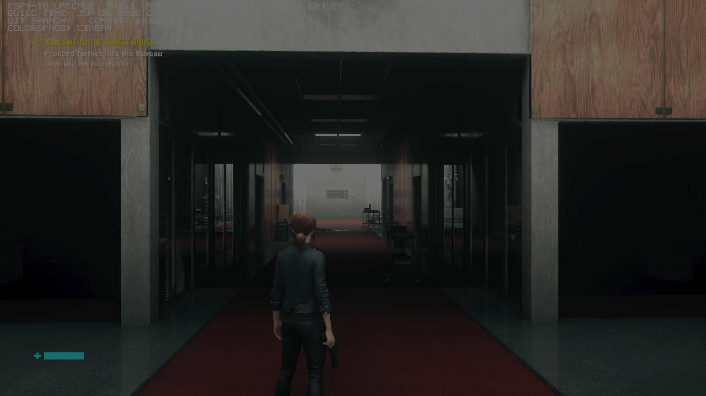

# Simplified cache setup: qualification

The updated Linux launcher was tested through real Steam game launches on BC250,
kernel **7.2.5-1.163-cachyos-bc250**, using the published RC10 private driver and
ordinary GE-Proton 11-6. The shader/driver binaries were unchanged.

## Cross-game reuse

| Launch | Cache input | Observed FSR compilation substitutions | Rendered result |
| --- | --- | --- | --- |
| Control Ultimate Edition / D3D12 | Empty shared store | 14 | Saved scene |
| System Shock / D3D11 through the adapter's D3D12 backend | Separate empty store | 13 | Animated title/menu |
| System Shock, fresh private translation cache and cache view | Control's shared store | 0 | Animated title/menu |

Control created **893** Mesa cache entries. An inotify observer saw the warm System
Shock run read **166** of those entries, whose contents remained identical to the
Control-created files. Only that private trial used the observed store during the
recording. The game's actual environment selected its own view of the same backing
store. The original AMD 4.1.1 provider, SDK bridge and exact RC10 driver were mapped
together in each game process; both captures showed the driver provider.

The substitution diagnostic was enabled for every trial and prints during shader
compilation. Its absence in the warm run, alongside the observed cache reads and
FSR4-rendered output, supports reuse of the compiled FSR path. The 166 entries are
**all matching Mesa cache reads**, not 166 distinct FSR4 shaders. These sessions
were unscored and included user-interface navigation and diagnostics. They do not
establish a game-loading-time percentage or an FPS change. System Shock remained
menu-only; its result is not gameplay qualification.



[System Shock with an empty cache](assets/cache-setup-shockcold.png) and
[System Shock reusing Control's cache](assets/cache-setup-shockwarm.png) are
unedited Gamescope captures. Control retained its HDR settings; these PNGs are
not physical HDR/colorimetry measurements.

The [machine-readable record](data/cache-setup-game-reuse-20260914.json) retains
component hashes, observed cache settings, exact substitution lists, cache-entry
hashes and screenshot hashes. It distinguishes the installed test-tool hashes
from the final helper source: subsequent installer changes retain the tooling
license and keep unselected interrupted staging data during uninstall. The cache
preparation/launch functions and imports compare identically as parsed code.
The full helper and driver-tool hashes in this record are retained under
`legacy/cache-setup-tools`, from commit `67870df`. The subsequent
[installer review](cache-review.md) has its own source hashes and tests; the
measured cache preparation code remains identical.

## Setup, diagnostics and portability

At that revision, the helper's 21 filesystem/launch tests passed in four isolated userspaces as an
unprivileged user: Debian Bullseye/Python 3.8, Debian Bookworm/Python 3.11,
Alpine/Python 3.12 and the Arch-based builder/Python 3.14. They cover existing
unwritable stores, full-disk write failure, non-mutating status, concurrent view
creation, missing Python, argument boundaries, generated Steam options, permanent
installation after download removal and cache-preserving uninstall. An independent
read-only mount check also falls back to the original command in each userspace.
[Exact userspace identities and outcomes](data/cache-setup-userspaces-20260914.json).

Driver installer checks cover integrated cache selection and per-launch bypass,
permanent launch tools, unchanged private-driver selection on cache failure,
upgrade/rollback of the launcher and cache preference, and read-only status.
The portable driver was rebuilt with the updated tooling and its stripped bytes
still match the qualified RC10 SHA256:

```text
5c4d74b141f946b8b11442d9886f10b62f4ecd022065d498d79ee4ac798eea4b
```

These userspace tests do not qualify complete graphics stacks on four distros.
The real-game checks use native Steam on this BC250. Other GPUs, native Windows,
full Flatpak/Heroic launches and unrelated game/driver combinations need their
own qualification. Heroic's wrapper fields are documented from its source;
they are not an additional real-game result here.

## Preservation

Tests used private game and Wine-prefix copies. Steam cloud was disabled during
each trial. SteamRemoteStorage can write outside a child userdata bind, so those
writes were preserved separately, the original local payloads restored before
cloud was enabled, and payload hashes checked again afterward. Original game
files, saves, cloud flags and launch settings were restored. Control's accepted
official LSFG wrapper remains; LSFG was disabled only in the test processes.
The system driver, display and tuning configuration were unchanged.

The original RC10 cache benchmarks and four-userspace records still refer to
their exact retained sources under `legacy/rc10-tools`. They have not been
relabelled as measurements of the new setup. The published RC10 assets are unchanged.
