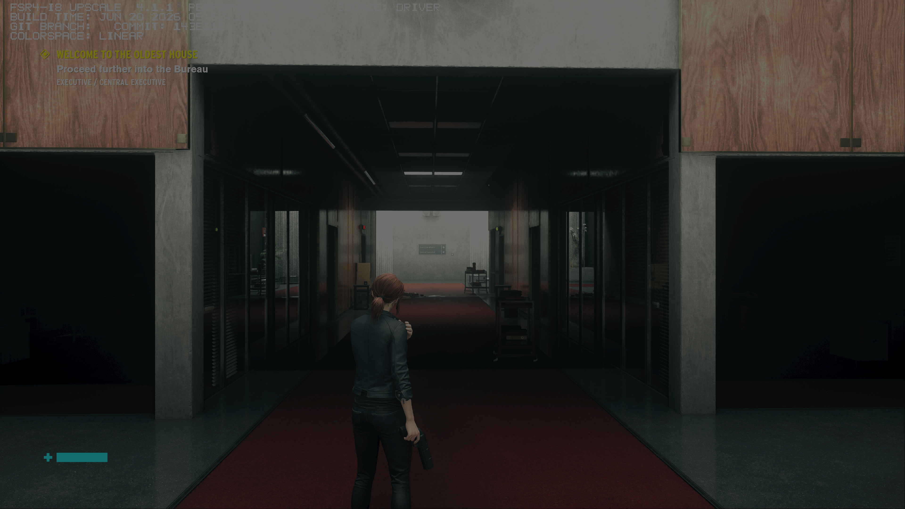
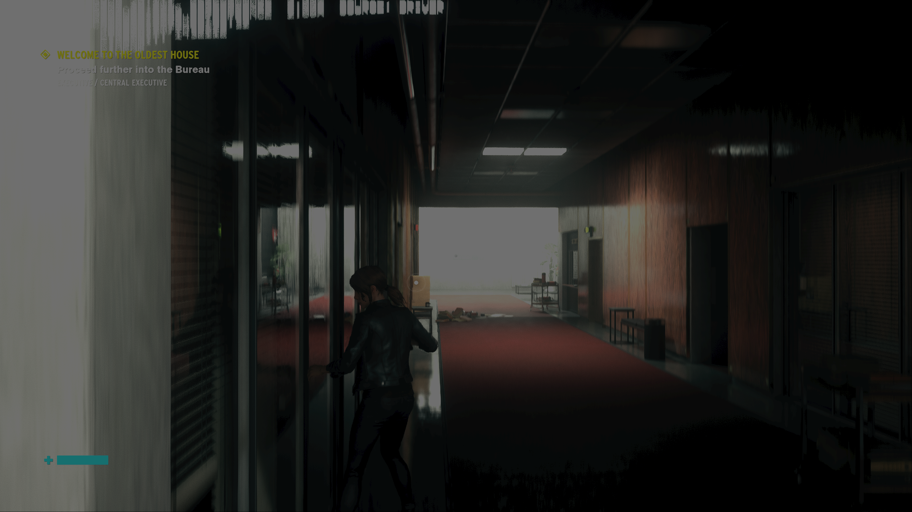

# RC10 driver gameplay qualification

**Control passed a Steam-launched driver-route gameplay check on BC250.**
The unmodified AMD 4.1.1 INT8 provider, SDK 4.0.2 bridge and exact RC10 RADV
binary were mapped together in the game process. The driver logged all 14
expected shader substitutions for this context. A saved scene rendered, and
scripted movement, camera input and a jump produced a changed view.

| Game / input | Observed result | Scope |
| --- | --- | --- |
| Control Ultimate Edition / D3D12 DLSS input | 4.1.1, source DRIVER; 14 exact substitutions; saved-scene navigation | Gameplay pass |
| System Shock / D3D11 DLSS input through OptiScaler's D3D12 backend | 4.1.1, source DRIVER; 13 exact substitutions; animated title/menu | Menu rendering only; not a gameplay pass |

Both sessions used ordinary GE-Proton 11-6, upstream OptiScaler
10.0.0-pre1 from September 4 and OptiPatcher 0.41. Each session was bounded
at 15 minutes, including startup, menus, input and diagnostic work. This is
not a 15-minute continuous-gameplay benchmark or a full playthrough. No new
FPS claim is made from these sessions. The separate synthetic measurements
remain the evidence for RC9 performance parity and output comparisons.

The driver SHA256 is
`5c4d74b141f946b8b11442d9886f10b62f4ecd022065d498d79ee4ac798eea4b`.
The AMD provider SHA256 is
`4e7dc37aebea3a90e3d3cc43e24cb2b54176b2535315f20dbe63b3b7cfc56b1e`.
The bridge SHA256 is
`241e6e5e4d848424eb8ec9a6b22c43fe34cf0cf52d30002ca435ba42e53a9ca0`.
The portable RC10 DLL was not used in these driver tests.

## Captures and shader evidence

These are unedited Gamescope captures. Control's existing HDR setting was
retained; an ordinary SDR image viewer does not reproduce the physical HDR
display. The provider's build-time/commit lines are upstream metadata. Identify
the fork's release by the driver hash, not those inherited lines. The original
provider keeps the name **4.1.1** and source **DRIVER**; the primary portable
DLL instead reports **4.1.1r10 / LOCAL**.

[System Shock's menu capture](assets/rc10-driver-system-shock-menu.png) is
retained separately. The automated trial did not enter a saved scene; its
menu result is not promoted into gameplay coverage. Its logged replacements
cover the twelve convolution passes and postpass. No prepass replacement was
logged for that context, and the driver's existing unmatched-input policy remains.

The [machine-readable record](data/rc10-driver-gameplay-20260914.json) includes
component hashes from the same process, shader-pair identities, capture hashes,
session limits and restoration checks. No proprietary game shaders or save
payloads are distributed in the evidence archive.

## Test isolation and recovery

Steam launched private game and Wine-prefix copies through a temporary launch
wrapper. Cloud sync was disabled for each tested title during its session.
Private userdata mounts alone do not isolate every Steam RemoteStorage write:
the native Steam client can still write the original local app userdata. Those
writes were preserved separately and the original bytes restored before cloud
was re-enabled. Save payloads were checked again afterward.

Original game files, prefix user files, cloud settings and launch options were
restored. Control's existing official LSFG settings and wrapper were preserved;
LSFG was disabled only inside the test processes, and no LSFG layer was mapped.
The system driver, display/tuning configuration and installed RC9 integrations
were not replaced. No new kernel GPU fault or reset was recorded.

The earlier offline Control smoke test only mapped the DLL; it is retained as
an earlier, incomplete attempt. These newer Steam-launched driver results are
separate from it and from the historical RC7 seven-game matrix.

Return to the [driver installation guide](driver-rc10.md) or
[RC10 release notes](release-notes-rc10.md).
