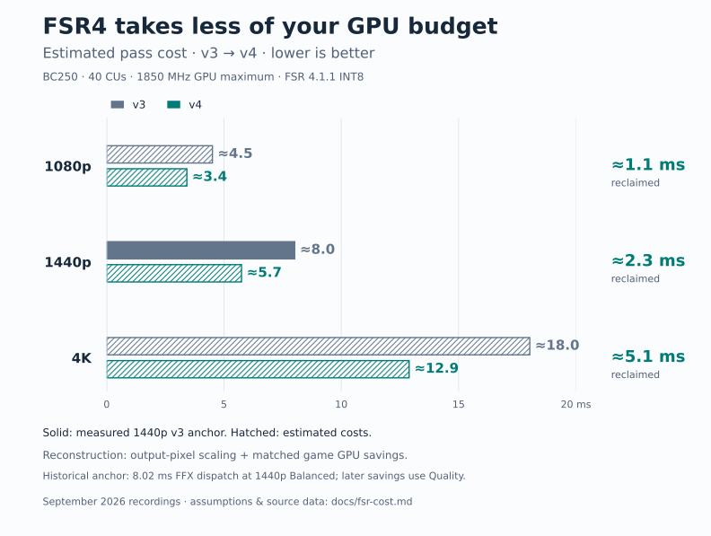

# FSR4 GPU cost: historical measurements and reconstruction

The README chart estimates the GPU time spent on FSR4 itself, using the best
retained direct timing anchor and the later matched v3/v4 GPU savings. It is
an illustration of the fork's benefit, **not an isolated-pass benchmark of the
release at all three resolutions**. No new game measurements were taken for it.



## The direct measurement we recovered

On September 6, completed GPU timestamps around the real FFX upscale dispatch
measured the original packaged v3 against development driver 2.84. Both used
Deadzone: Rogue, FSR 4.1.1 INT8, corrected linear color and **Balanced,
1506×848 → 2560×1440**, on a **40-CU BC250 with a 1850 MHz GPU maximum**.
The dynamic governor used 940 mV at that maximum; post-window clocks were
1850, 1850, 1850 and 1840 MHz.

| Launch order | Driver | FFX GPU mean | Completed samples |
| --- | --- | ---: | ---: |
| 1 | Arithmetic development driver 2.84 | 5.84336 ms | 195 |
| 2 | Original packaged v3 | 8.01732 ms | 166 |
| 3 | Original packaged v3 | 8.01321 ms | 166 |
| 4 | Arithmetic development driver 2.84 | 5.82758 ms | 194 |

Equal weighting of the two launches gives **8.01527 → 5.83547 ms**, a directly
measured **2.17980 ms / 27.20%** reduction. The optimized endpoint predates the
full v4 release. Each launch used a three-second warmup, a ten-second window
and one timestamp sample per four dispatches. Completion fences were verified;
timer, unsupported-call, unmatched-call, queue and overflow counters were zero.
The samples measure the FFX interval, including SDK sharpening if requested,
and exclude a separate OptiScaler RCAS pass. Deadzone had sharpening disabled.

The original packaged v3 ELF was `79018a8d09a279d2ef01af935d0f5fc0459e565e59e73e494c060f2700d205f6`.
It differs from the later source-built v3 baseline in the
[release performance campaign](performance.md#what-the-baseline-represents).
The exported [timestamps](data/fsr-cost-20260908/ffx-samples.csv) and
[provenance](data/fsr-cost-20260908/provenance.json) retain both driver identities,
timer identity, original record hashes and per-launch validation summaries.

## How the chart is reconstructed

Use the measured 8.01527 ms v3 cost as the 1440p anchor. Scale it by output pixel
count for 1080p and 4K, then subtract the **whole-frame GPU** reduction from the
September 7 [matched release campaign](performance.md). All v4 pass costs are
therefore estimates; the 1440p v3 bar is the historical Balanced measurement.

```text
v3 cost(output) ≈ 8.015267 ms × output pixels / (2560 × 1440)
v4 cost(output) ≈ v3 cost(output) − matched whole-frame GPU reduction
```

| Output | Pixel ratio | v3 cost | Measured whole-frame GPU reduction | Estimated v4 cost |
| --- | ---: | ---: | ---: | ---: |
| 1920×1080 | 0.5625 | ≈4.51 ms | 1.08929 ms | ≈3.42 ms |
| 2560×1440 | 1 | 8.01527 ms, historical Balanced | 2.26787 ms | ≈5.75 ms |
| 3840×2160 | 2.25 | ≈18.03 ms | 5.14290 ms | ≈12.89 ms |

The chart rounds costs and savings to one decimal place. Its approximate
labels describe model uncertainty, not confidence intervals. The uncertainty
is larger than the small spread within the historical timestamp windows.

Three assumptions limit these estimates:

- The historical packaged-v3 **Balanced** cost approximates the later
  source-v3 **Quality** cost. Input size, sharpening, game integration, Mesa
  version and build differences can change the interval.
- FSR4 cost scales with output pixels. Fixed overhead, cache behavior,
  dispatch padding and provider resolution buckets can break this assumption.
  **4K is an extrapolation without a direct FFX timing anchor.**
- The whole matched GPU reduction comes from FSR4. Those measurements cover
  the entire engine frame and both driver implementations, so other work and
  GPU overlap can affect the delta. The chart cannot establish that allocation.

The remembered ~4.5 ms 4K saving came from the earlier Cyberpunk whole-frame
comparison. This chart consistently uses the newer Deadzone **GPU-time**
deltas, including 5.14 ms at 4K, rather than mixing FPS-derived frame times
with GPU timestamps. The [measured release table](performance.md) remains the
authority for exact v3/v4 game results.

## Other evidence considered

The historical Control 1080p Quality capture measured **4.76167 ms** with 2.84.
That driver preceded small-resolution arithmetic coverage. It supports the
rough scale of the 4.51 ms estimate, but its game, sharpening and driver are
different; it is not a measured v3 baseline. A later 1440p Balanced composed
candidate measured **5.73549 ms** against fresh 2.84 controls at **5.80444 ms**.
That is consistent with the reconstructed ~5.75 ms endpoint, but the candidate
is not the release ELF and the controls were separate launches.
The [corroborating summaries](data/fsr-cost-20260908/corroboration.json) preserve
these records and their original file hashes; neither enters the calculation.

Earlier resolution matrices with the defective nonlinear color setting were
excluded. Independently timed synthetic kernels were also excluded from the
pass-cost calculation: adding their medians does not measure an inclusive
FFX dispatch. No native-resolution game frame was subtracted from an upscaled
frame, which would mix different rendering workloads.

## Reproduce or embed

The calculations use only Python's standard library. Rendering additionally
requires Matplotlib (tested with 3.11.1):

```sh
python3 docs/data/fsr-cost-20260908/reconstruct.py
python3 docs/data/fsr-cost-20260908/plot.py
```

The first command verifies exported hashes, timestamp arithmetic, completion
flags, sample counts and original means before recomputing the
[estimates](data/fsr-cost-20260908/estimates.json). The plot reads that calculation
directly. Both [SVG](assets/fsr4-v3-v4-cost.svg) and
[PNG](assets/fsr4-v3-v4-cost.png) include the estimation disclosure for sharing.
