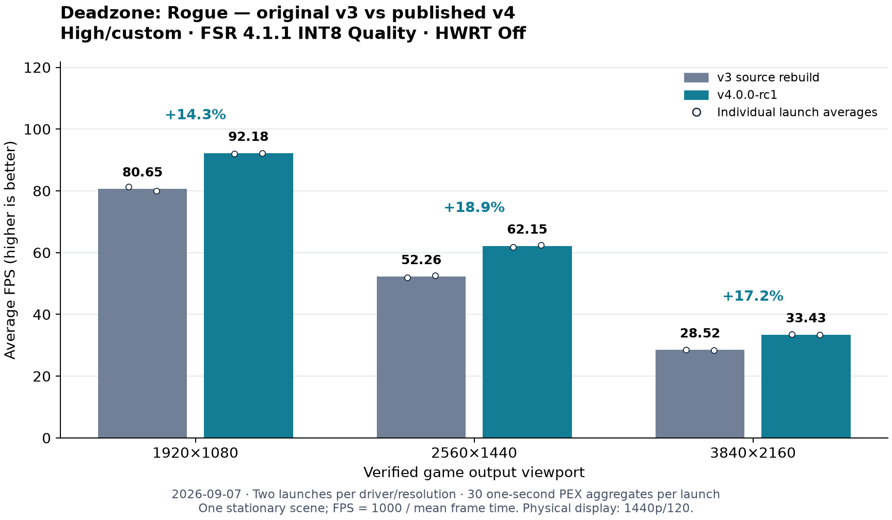
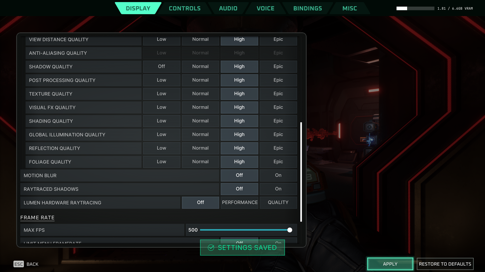

# Fresh v3 versus v4 performance — 2026-09-07

The published v4.0.0-rc1 binary was compared with a verified rebuild of the
original upstream v3 driver in Deadzone: Rogue at three output resolutions,
on a **BC250 with 40 compute units (CUs) active** in both driver arms.
**Lumen hardware ray tracing is off; FSR 4.1.1 INT8 Quality is on.**

These results use the pinned **FSR 4.1.1** provider, not the newer **4.1.1b**
mod. Do not co-install 4.1.1b with this setup. The measurements do not cover
4.1.1b or mixed runtimes; see [runtime compatibility](games.md#runtime-compatibility).

| Game output | v3 FPS | v4 FPS | FPS gain | v3 → v4 whole-frame GPU ms |
| --- | ---: | ---: | ---: | ---: |
| 1920×1080 | 80.65 | 92.18 | +14.3% | 10.256 → 9.166 |
| 2560×1440 | 52.26 | 62.15 | +18.9% | 15.238 → 12.970 |
| 3840×2160 | 28.52 | 33.43 | +17.2% | 30.292 → 25.149 |

Two independent launches per driver at each resolution, in v3/v4/v4/v3 order:

| Game output | v3 launch averages (FPS) | v4 launch averages (FPS) |
| --- | ---: | ---: |
| 1920×1080 | 81.30, 80.00 | 92.09, 92.27 |
| 2560×1440 | 51.97, 52.57 | 61.82, 62.49 |
| 3840×2160 | 28.63, 28.41 | 33.48, 33.38 |

## What the baseline represents

The v3 arm is **Mesa 26.2.0 plus the exact upstream v3 patch** at
`6173651fa3a5a557cba2c2ff802e2d6f49881bc1`, rebuilt from source for this host's
LLVM ABI. The upstream prebuilt ELF has an unresolved LLVM-versioned C++ symbol
here; using it would not give a working baseline. The rebuild retains v3's
release/O3, LLVM-enabled RADV/ACO configuration, with no LTO. Unused Gallium and
OpenGL targets are omitted. All 12,803 archive regular files were compared to
the build tree, with the eight patched files checked against independently
reproduced upstream-patch outputs: no mismatches. The eight archive links and
125 vendored Wayland files also match their archives; remaining extra files are
generated Python
bytecode, Meson metadata and the package cache.

The v4 arm is the **exact published v4.0.0-rc1 native binary**, Mesa 26.2.2,
generic x86-64/O2, LLVM disabled, RADV/ACO, no LTO. Both were built with GCC
16.2.1. This measures the offered driver implementations, including Mesa and
build differences; it does not isolate a single optimization. The v3 baseline
is not v4 with `BC250_FSR4_DISABLE=1`.

| Identity | SHA256 |
| --- | --- |
| v3 source rebuild | `88214d555c1887f14478368c55dab081d2462365e2dc5f0f239d9884c808a6cd` |
| Published v4 ELF | `6bc07c5a9d8404aba98dbdd912ffb58988fd760f50460d3b614d85eb8a7638d5` |
| FSR 4.1.1 provider (`amdxcffx64.dll`, both arms) | `4e7dc37aebea3a90e3d3cc43e24cb2b54176b2535315f20dbe63b3b7cfc56b1e` |
| OptiScaler (both arms) | `469bcfe59108f04f8b8cf45953e515f0a0cd24b00717be62b7dcf5c20430410d` |

Each arm uses a separate explicit private ICD and persistent Mesa/VKD3D cache.
The actual library mapped into the game is checked by path and SHA256 at every
run. No `BC250_FSR4_*` override is present in either arm. The installed system
and 32-bit drivers stay unchanged.

## Matched workload and scoring

Deadzone: Rogue uses native FSR **4.1.1 INT8 model 2, Quality mode, linear color**.
Lumen Hardware Raytracing was changed from Performance to **Off in the
in-game menu**, applied and verified again after restarting. Ray-traced
shadows are also off. Each run starts from that menu-written configuration,
where the default Off value omits the `LumenRaytracing` entry. Frame generation
and dynamic resolution are off. The existing High/custom graphics preset, pinned OptiScaler build, named OptiPatcher v0.41, provider and
GE-Proton11-6 are identical across all runs. Reflex, VSync, gyro and the visible
OSD/watermark are off. Gamescope is uncapped with VRR off; the game limit is
500 FPS. All four physical controllers were temporarily deauthorized to prevent
camera drift. The same save position and view are used, without movement or
firing; save hashes remain unchanged.

At each resolution, launch in **v3, v4, v4, v3** order. After loading the scene,
discard 60 seconds and take the first 30 consecutive valid one-second rows from
the game's existing buffered PEX timeline. Require one pawn, valid timing
values, continuous timestamps, correct focus and cap state. Verify matching
configuration, driver/provider identity, full 16-thread CPU affinity and no
logged PSO-creation wait during the selected window. The plan and harness were
hashed before the first accepted window. All 12 planned runs are retained.

FPS is `1000 / mean(FrameTime_ms)` across the two equally sized runs. GPU time
is the engine's **whole-frame `GPUTime`**, not isolated FSR execution time.
The one-second aggregates do not support 1% lows, per-frame latency tails or
confidence intervals treating the 60 adjacent rows as independent launches.
The two launch averages are listed to show observed repeatability.

CPU stays at 3800 MHz / CO −25. The existing dynamic GPU governor has a
1850 MHz / 900 mV maximum, with automatic cooling. No clocks, voltages, kernel
or firmware are changed. The host is CachyOS on kernel 7.2.3-1.83, RADV
GFX1013, with **40 CUs active** (KFD reports 80 SIMDs). The CU configuration
is unchanged between the v3 and v4 runs.

## Resolution and presentation

| Verified game output viewport | Nominal Quality render size |
| --- | --- |
| 1920×1080 | 1280×720 |
| 2560×1440 | approximately 1707×960 |
| 3840×2160 | 2560×1440 |

The engine log verifies the requested output viewport on every run. Separate
unscored watermark proofs verify native INT8 4.1.1 and 1.50× Quality scaling.
Internal dimensions above are derived from that mode, not from traced dispatch
sizes. The physical display stays **2560×1440 at 120 Hz** throughout, with the
game SDR inside the existing HDR compositor path. Gamescope's virtual game mode
allows actual 4K game output without changing the host's HDMI workaround.
Screenshots are the final 2560×1440 compositor image, not native 4K exports.

## Exclusions, reproducibility and scope

A first proof launch raced Steam startup and produced no score. An initial
attempt showed a watermark despite the explicit `false` option and was stopped
before its scoring window. The frozen accepted campaign uses the documented
quiet `auto` value. A multi-run orchestration process was interrupted between
windows; the same pending run and unchanged sampling rule were continued with
one launch per command session. The user then requested hardware ray tracing
off. The initial campaign was stopped after seven complete windows, with no 4K results. Those HWRT Performance
runs are retained separately and do not contribute to this new 12-run campaign.

The sample CSV contains all 360 selected PEX aggregates, with run IDs and UTC
timestamps. `summarize.py` recomputes the resolution averages using only Python's
standard library; `results.json` records per-run means, checks and retained
raw-file hashes. The source/build identity and configuration evidence accompany
the data. Proprietary game files, shader dumps, provider DLLs and personal saves
are not redistributed. Reproducing the scene requires the game and an equivalent
save position; the public data can independently reproduce the published math.

These are fresh measurements of one stationary scene, one game and one 40-CU host,
with two launches per driver per resolution. They establish a gain in this
workload, not a universal game-performance percentage. Earlier development-driver
on/off results used a different baseline and scene/setup and are not pooled
with these measurements.

[v3 native INT8 proof](assets/deadzone-performance-v3-proof.png) · [quiet v4 4K game viewport, captured at physical 1440p](assets/deadzone-v4-4k-hwrt-off.png) · [all samples](data/performance-20260907/samples.csv) · [results and validation](data/performance-20260907/results.json) · [recompute averages](data/performance-20260907/summarize.py) · [v3 provenance](data/performance-20260907/v3-baseline.json) · [scoring plan](data/performance-20260907/scoring-plan.json) · [configuration](data/performance-20260907/configuration.json)

The host was restored after testing: original launch fields, runtime links,
saves and other game preferences, with the requested HWRT Off setting retained.
This is a later qualification addendum; the v4.0.0-rc1 tag and original binary
and source release assets remain unchanged.
