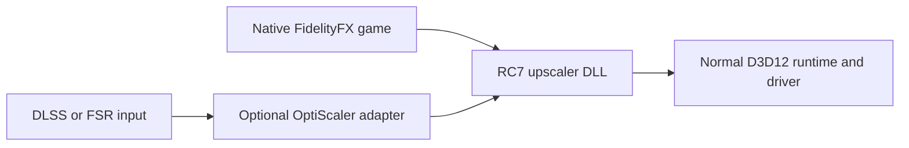

# RC7 portable DLL: compatibility and review

RC7 makes the optimized **FSR 4.1.1 INT8 DLL** the primary product. Users
replace one compatible upscaler DLL. The performance implementation is
compiled into that file; a custom Mesa package or custom Proton tool is no
longer required. The [installation guide](../dll/INSTALL.md) accompanies the
binary download. RC6 remains a separate, retained installation and recovery path.

The same DLL supplies both routes. OptiScaler adapts an application's input
API, including supported DX11/Vulkan interop routes. It is not where RC7's
shader performance changes live. The compact tar.xz and ZIP are two formats
containing the same DLL, instructions, checksums and notices; neither is an
installer or a Steam compatibility tool.

## Supported scope

The qualified hardware is **AMD BC250 / RADV GFX1013 on CachyOS Linux**.
The DLL itself is a Windows x64 PE image. Ordinary D3D12 translation and
driver shader compilation are still required by the platform.

| Context | Evidence and limit |
| --- | --- |
| Direct FFX API / D3D12 | Context creation, GPU dispatch, finite full-image readback and destruction with ordinary Proton; shader lowering fixes the prior Proton 10/11 failure |
| Control / DX12 DLSS | RC7 rendered a loaded-save scene through upstream OptiScaler and ordinary Proton Experimental; watermark and 14 captured shader hashes identify the local DLL |
| System Shock / DX11 DLSS | RC7 rendered the 3D menu through upstream OptiScaler and ordinary GE-Proton 11-6; 14 matching shaders, with the separate AMD driver provider disabled |
| No Man's Sky Cosmos / Vulkan DLSS | RC7 rendered a loaded-save scene through upstream OptiScaler and ordinary Proton Experimental; 14 matching shaders, with the separate AMD driver provider disabled |
| Native game DLL replacement | Deadzone Rogue and KCD2 established the filename/loader routes with the preceding DLL; see the precise scope below |
| Native Windows and other GPUs | Unqualified; external testing is required |
| Frame generation, ray regeneration, Luma/ReShade combinations | Outside this DLL candidate's qualification |
| Steam Flatpak / other sandboxes / other Linux distributions | No separate operating-system or sandbox qualification; make the DLL and adapter files accessible inside the application's environment |

The System Shock and No Man’s Sky checks used the preceding RC7 build
(`b68c1c0b…`) with the same 348 shader blobs, before the SDK barrier repair.
They establish those adapter routes, but do not represent executions of the
final DLL. The API, image and timing results below use the final bytes; the
Control follow-up also checks the final DLL.

The exact runtime identities, shader/image hashes and measured results are
in [the candidate record](data/portable-dll-rc7.json). A menu or scene check is
bounded functionality evidence, not an endurance test or an installation
allowlist. Previous RC3 runtime gameplay results do not automatically transfer
to this DLL.

## Proton compatibility change

The preceding optimized DLL failed when ordinary Proton 10 and 11 attempted
to translate vector integer extensions. It created the SDK context, then
failed during shader translation. Fresh private prefixes reproduced that
failure, excluding stale-prefix state as its cause.

RC7 lowers **17,964 `sext`/`zext` operations in 48 model shaders** from
two-lane 16-bit vectors to separate scalar extensions followed by vector
reassembly. The other 300 shaders retain their previous compiled hashes.
Packed arithmetic, shifts, bitcasts, wave policy, model guards and memory
operations are unchanged. This preserves each lane's signedness and every
input bit pattern.

Executable LLVM checks cover all 65,536 16-bit values in each lane for both
signed and unsigned extensions. GPU comparisons match the original INT8
reference exactly on the previously failing translator. All 348 rebuilt
shader containers pass the pinned DXC validator.

The shaders still use **DXIL 1.9 / Shader Model 6.9**. They are not relabeled
as older bytecode. Native Windows requires a D3D12 runtime and driver that
accept those shaders. Linux success through vkd3d does not establish native
Windows support. Other GPUs may have different wave or integer performance;
the BC250 measurements below are not predictions for them.

## SDK synchronization repair

Review found an intermittent small-image error in the preceding optimized
DLL. The cause was the SDK's padding-clear scheduling: its compute jobs set
`FFX_GPU_JOB_FLAGS_SKIP_BARRIERS`, allowing a clear to overlap preceding model
work on the shared scratch buffer. The
[pinned SDK buffer-UAV binding loop](https://github.com/GPUOpen-LibrariesAndSDKs/FidelityFX-SDK/blob/60f4ea81909200d8542eca14dccb2628b763a9a3/Kits/FidelityFX/backend/dx12/ffx_dx12.cpp#L3599)
contains the skipped barrier call.

RC7 changes one instruction-immediate byte so this existing call remains
active for non-null buffer UAVs. It adds no new code section, runtime hook,
configuration option or installed component. The texture and SRV policies
and all shader arithmetic remain unchanged.

The diagnosis used the original INT8 shaders as a control. With the missing
UAV barriers supplied before padding clears, both implementations produced
the same four-frame 192×144 image even when the entire scratch buffer began
with either zero or `0x3f` bytes. Its SHA256 is
`d52cb63f378dc0eb3f90044884534f91c6fec208919c9060ab5618d5bf107c9b`.
The final DLL produces that image without probe-supplied barriers. The earlier
`d6b3c5...` hash belonged to the unsynchronized path and is superseded for this
small test. The [optional probe audit](../dll/probe/README.md#observe-the-sdk-barrier-repair)
observes the SDK's barriers without adding GPU commands.

The investigation also ruled out changing shader-cache bytes and rejected
explicit discard-store guards and forced compiler waits as fixes. Those
diagnostic variants are not included in the release.

## Ordinary OptiScaler setup

Install the upstream adapter normally, then replace its upscaler backend
with RC7. The [short guide](../dll/INSTALL.md#with-optiscaler) gives the FFX
backend, INT8 model and linear-color settings. Retain upstream game-specific
input/spoofing options. Frame generation was off in these checks.

The adapter used for the recorded game checks is the unmodified
OptiScaler 10.0.0-pre1 nightly from September 4, 2026; its WinMM proxy hash is
`469bcfe59108f04f8b8cf45953e515f0a0cd24b00717be62b7dcf5c20430410d`.
OptiPatcher 0.41 and the ordinary signed NGX helper accompany that adapter.
These components are obtained separately and are not bundled in RC7.

**Signature-helper placement matters.** System Shock did not expose DLSS
when the test kept the helper only in an external library directory, even
with `Libraries.NvngxDlssPath` set. Placing the signed `nvngx_dlss.dll`
beside the proxy restored NGX initialization and actual DX11-to-D3D12 FSR
dispatch. The initial incomplete-layout trials remain negative evidence.
This is why the guide starts with a working upstream adapter installation.

Some Proton releases ship their own optional `amdxcffx64.dll` under `contrib`.
Its presence does not identify the selected rendering backend. Control used
the local RC7 SDK despite that stock component being present. The System Shock and No Man's Sky
checks explicitly disabled it through a temporary Wine override, and still
rendered using all 14 expected RC7 shaders. No Man's Sky used the ordinary
Vulkan capability spoofing required to expose DLSS, and excluded unsupported
`VK_NVX_binary_import,VK_NVX_image_view_handle` extensions only from vkd3d
through `VKD3D_DISABLE_EXTENSIONS`. Its existing signed NGX helper was retained. No RC6 driver-provider or custom
Proton manifest was used for these adapter checks.

Enable the temporary FSR watermark or inspect actual adapter dispatch logs
to distinguish the local `4.1.1r7` path from a fallback. DLL loading alone is
insufficient. Leave the default linear-input policy in place unless the
application integration specifically supplies a different color encoding.
Set the optional sRGB/PQ child controls to `auto`; forcing those child keys
to `false` has different semantics in this OptiScaler version.

## Native game loaders

The DLL exports the same five FFX entry points and retains the numeric
SDK/provider identity. It implements upscaling, not every FidelityFX effect.
Native loader compatibility must be checked against the game integration.

| Game | Replacement location | Verified native integration |
| --- | --- | --- |
| Deadzone Rogue 1.4.2.0 | `Valhalla/Binaries/Win64/amd_fidelityfx_upscaler_dx12.dll` | Rendered native-FSR menu and matching shader hashes |
| KCD2 1.5.6 | `Bin/Win64Shared/amd_fidelityfx_loader_dx12.dll` | Same DLL bytes under this filename; rendered a saved scene with FSR 4.1 Quality, preserving the original upscaler file |

Those two game checks used the preceding DLL with SHA256
`066fc2a4e5df3a31203085028939d9cc2a7a4dd45eceaf2c946bb580321f2746`.
RC7's changes preserve its SDK interface and shader arithmetic, but those
native game checks are not being represented as executions of the final RC7
bytes. The direct API and adapter checks have their own exact artifact records.

KCD2's older loader called an incompatible private provider-vtable slot when
only the upscaler file was replaced. Calling the new SDK at the loader entry
point avoided that old private interface. Do not generalize this rename to
games whose loader also services frame generation or other FidelityFX effects.
Restore the original file if a native integration fails; use a separately
qualified adapter route when available.

## Correctness and performance

The RC7 comparison used a full-upscaler D3D12 timing probe and 240 frames per
run. At each output size the order was existing v4, v4 with the same SDK
synchronization repair, DLL, DLL, repaired v4, existing v4. It used ordinary
GE-Proton and a standard Mesa driver for the DLL, with the retained v4 driver
as control. Debug shader dumping and per-pass tracing were off in scored runs.

| Output | v4 GPU time | RC7 DLL GPU time | Difference |
| --- | ---: | ---: | ---: |
| 1920×1080 | 3.73320 ms | 3.77562 ms | +1.14% |
| 2560×1440 | 6.57114 ms | 6.61629 ms | +0.69% |
| 3840×2160 | 13.61564 ms | 13.75154 ms | +1.00% |

The table compares the existing v4 driver path with the corrected RC7 DLL. Each
entry is the mean of two per-run medians. All eighteen scored full output
images were byte-identical within their output-size groups. This is practical
parity within 1.14% for these checks, not a formal statistical equivalence
bound or a whole-game FPS measurement.

For the comparison with the same SDK repair applied to both sides, v4 measured
3.78318, 6.62189 and 13.54739 ms respectively. The DLL's differences were
−0.20%, −0.08% and +1.51%. The record includes all 4,320 frame timestamps and
both comparisons. Absolute timings drifted between campaigns; only matched
controls in this campaign are used.

The small-image mismatch found during review is addressed by the SDK
synchronization repair above. Larger scored outputs retained their image
hashes after the repair. Size and temporal checks have separate records;
performance parity does not establish correctness at every possible size.

The final DLL's image matrix contains 20 cases and 54 complete images,
compared with the original SDK shaders using the same synchronization repair
and standard Mesa. Seventeen cases, containing 42 images, match exactly.
They cover tiny and standard sizes, sharpening, HDR, motion, resets, dynamic
resolution and an 8K context reserve. The formerly inconclusive 2400×900 and
600×1800 outputs now pass repeated comparisons.

Three cases remain unqualified: 193×145, 2401×901 and 193×145 with the large
context reserve. The original-shader reference varies on repeat in each case,
even with the barrier repair. These are recorded limits, not passes or a
newly inferred blanket alignment rule. All six guarded-model families
previously passed modified runtime-weight and fast-path witness checks;
RC7 preserves those guards and fallbacks, with the documented integer-cast
and host-synchronization changes.

## Coming from RC6

Switch one game at a time. Keep its original game-file backups and saves.
Close the game, select an ordinary Proton tool in Steam, and retire any
game-local hooks owned by the old integration using their original recovery
method. Run the ordinary tool once before installing a new game-local
adapter so its prefix can reconcile. Do not copy a second proxy over an
unknown existing installation or delete the prefix to change upscalers.

For native FFX, install the appropriate single DLL replacement. For other
inputs, install the normal upstream OptiScaler adapter and replace its backend
DLL. Remove inherited launch variables that select another upscaler or a
private driver before evaluating RC7. The DLL itself needs no global Vulkan
ICD export, `PROTON_UPSCALER_MANIFEST`, BC250 installation service or account scan.

RC6 can remain installed for other games or rollback. A system-package-owned
driver is independent of this DLL installation: switching a game does not
require replacing that system package. The recorded standard-Mesa test
establishes that the DLL does not depend on the v4 driver rewrites.

To roll back a trial, close the game, restore the replaced game DLL and remove
only adapter files introduced for that trial, then reselect the retained RC6
tool if that was the previous integration. Preserve unrelated mods and saves.
Use the [RC6 recovery guide](legacy-rc6.md) for RC6 component management.

## Review and reproduction

The [developer guide](../dll/README.md) describes the source inventory, SDK
host-byte changes, PE pointer/relocation checks and exact rebuild. The new
tests exercise integer-extension equivalence, input-boundary failures,
deterministic packaging, checksum contents and separate DLL/runtime release
identities. The CI DLL job rebuilds the same pinned source without GPU access.

Qualification reports should name the DLL hash, GPU, OS/driver, Proton or
D3D12 runtime version, game/version, renderer, adapter version and input,
selected FSR mode, visible output and normal exit result. A Windows/other-GPU
report also needs the actual native shader-compilation/dispatch outcome.
Keep logs focused and omit account data, saves and proprietary game shaders.
