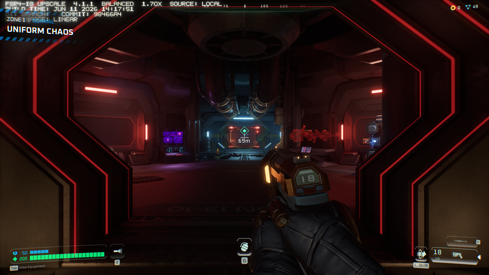

# v4.0.0-rc1 qualification — 2026-09-07

The fresh native x86_64 release passed source/compiler/output checks and two
real Deadzone launches after a recoverable return to a v3-style setup. Both
the migrated private v3 launch path and the normal system package path rendered
FSR 4.1.1 INT8. This is proof of operation, not a new performance benchmark or
blanket acceptance of every game.

## Exact driver and source

- Mesa source: **26.2.2**, SHA256-pinned archive and three ordered zero-fuzz
  patches in `v4/manifest.json`; all fifteen modified source hashes match the
  accepted production checkpoint.
- Released/native stripped driver SHA256:
  `6bc07c5a9d8404aba98dbdd912ffb58988fd760f50460d3b614d85eb8a7638d5`.
- Native unstripped build SHA256:
  `8bf52072a97e20e62715c6174049fbcfbe47fc0ccf575e4613c219f6ed02227d`.
- Container unstripped build SHA256:
  `9b1b633ed5018ee80117ea4f57bf76a95558c3c42804386e4a575c84e47a6813`.
- GCC 16.2.1, generic x86-64 flags, ACO, LLVM disabled, RADV u_trace disabled.
  Minimum referenced symbol versions in the native ELF are GLIBC 2.38,
  GLIBCXX 3.4.29 and CXXABI 1.3.9; the full dependency/version lists are in
  each archive's `build-provenance.json`.

This candidate contains the previously qualified optimization source. It was
fully rebuilt from the pinned original Mesa archive; it is not a renamed copy
of the earlier installed development driver.

## Validation

| Check | Fresh native build | Fresh Podman build |
| --- | --- | --- |
| Fifteen modified source hashes | Pass | Pass |
| Complete allocated compiler programs vs accepted references | 92 exact matches | 92 exact matches |
| Complete tensor outputs / preserved input buffers | 96 passes | 12 selected passes |
| Image / texture outputs | 12 passes | 12 passes |
| Installed normal-loader tensor outputs | 12 passes | Not installed system-wide |
| Real Deadzone native FSR4 rendering | Private and system routes | Not used for the game acceptance |

The compiler matrix includes all three resolution buckets, composed stages,
legacy inputs, disabled optimizations and guarded fallbacks. Tensor checks
compare complete outputs and buffer integrity, including odd extents and
unsupported weights. Some checks use locally obtained proprietary game shader
artifacts. Those inputs are identified by hash in the retained qualification
records and are not redistributed; the entire numerical campaign cannot be
reproduced using this public repository alone.

Installer/game-tool tests cover corrupt or unsafe archives, missing/changed
payloads, unresolved lazy-bound symbols, failed activation, v3 migration and
exact rollback, user edits after installation, interrupted-transaction
recovery, changed game SDKs and unrelated existing proxy DLLs. Tooling checks
run in CI without a GPU. See [the machine-readable summary](qualification.json).

## Real upgrade and rollback

The pre-test host driver/helper packages were retained. The 64-bit system
RADV was returned to its original `3:26.2.2-2.82` package, and a genuine
upstream v3 source build (Mesa 26.2.0 plus the original v3 patch) was installed
privately. Its existing v3 setup script generated the ICD and eager loader
validation passed. The published upstream v3 binary was not substituted for
that build: it has an unresolved LLVM-versioned C++ symbol on this host,
despite a plain `vulkaninfo` being able to initialize it.

The README archive install migrated the old v3 ICD while retaining the
existing Steam launch string. Rollback restored the old JSON byte for byte
and reinitialized the v3 source driver; reinstall selected v4 again. Deadzone
then rendered actual gameplay through that migrated launch path.

The system package was built from the exact retained base package. Install,
package-integrity checks, exact original-driver rollback, inactive status and
reinstall all passed. Both original Steam launch strings were restored, and
Deadzone rendered gameplay through `/usr/lib/libvulkan_radeon.so` using
Steam's normal runtime ICD. Pressure Vessel itself creates `VK_DRIVER_FILES`
and `VK_ICD_FILENAMES` inside its sandbox; their presence is normal here and
does not mean a private research driver was selected.

## Game proof

The test used the documented Deadzone helper with the pinned OptiScaler
20260904 build, named OptiPatcher v0.41, GE-Proton11-6 and AMD provider 4.1.1.
The native engine logged successful FSR 4.1.1 initialization; live mappings
matched the release driver and provider hashes. INT8 model 2 and disabled
frame generation were verified. Both screenshots show **FSR4-I8 4.1.1,
Balanced 1.70x, local source, linear color** at 2560×1440 output.

The watermark identifies the AMD provider/model, not the Mesa fork revision.
The live mapped driver SHA256 establishes the v4 identity. Its companion
[private-install proof](assets/deadzone-private-v4.png) used the migrated v3
launch path. This test did not time an FPS gain or assess every temporal
artifact across extended play.

Afterward, the original game settings, runtime links, quiet configuration,
launch fields and save-file hashes were restored. The qualified v4 system
library remains installed. Original CPU/GPU/fan configuration was preserved;
no game tracing, kernel change or clock/voltage change was used for this test.

## Scope and remaining limits

Only **x86_64 / GFX1013** is released. The existing 32-bit system driver stayed
unchanged throughout. A prior new i686 candidate had an unresolved Vulkan
instance-initialization fault; this release does not claim to fix or qualify
it. A fresh kernel/firmware installation, other GPU families, Steam Flatpak,
ARM-hosted container emulation and other distributions are not qualified by
this test.

KCD2 and Control helpers carry known predecessor integration routes; they were
not newly played for this release. Unknown/new provider shaders use the
original guarded fallback and do not gain a blanket performance guarantee.

Earlier quiet Deadzone 1080p Quality trials of this optimization family
measured 86.68 → 100.37 FPS and 9.5849 → 8.4884 ms engine whole-frame GPU time
in a stationary scene over mirrored runs. Those are prior scene-specific
results, not timings of this release. The internal resolution buckets do not
map one-to-one to “2K” and “4K”; ordinary 1440p and 2160p can share the middle
bucket.
